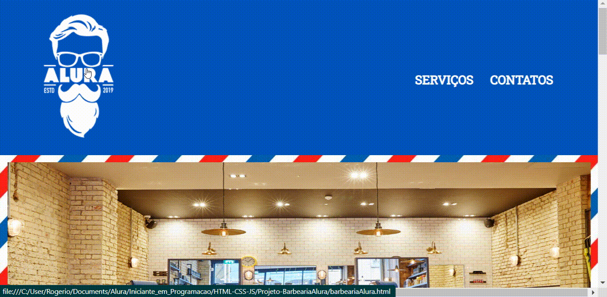

<h1 align="center">Barbearia Alura</h1>

## :bookmark_tabs: Índice:
- [Descrição](#pagewithcurl-descrição)

- [Demonstração](#mega-demonstração)

- [Objetivos](#dart-objetivos)

- [Tecnologias Utilizadas](#heavycheckmark-tecnologias-utilizadas)

- [Desenvolvedor](#grinning-desenvolvedor)
## :page_with_curl: Descrição:
Site de uma barbearia, contendo três páginas interativas.

## :mega: Demonstração:
- Página "Home"

- Página "Serviços"

- Página "Contatos"

## :dart: Objetivos:
Projeto desenvolvido para exercitar e fixar conceitos, tais como: semântica, enconding, estrutura, alinhamento, tamanho, espaçamento, cor, background, css inline, link, identificador, imagem, lista, referência, divisão, posicionamento, borda, pseudo-classe, unicode, formulário, hierarquia no css, transição, escala, rotação, tabela, unidade, proporção, flutuação, fonte externa, incorporamento de mapa e video, gradiente, pseudo-elemento, seletor avançado, opacidade, sombra, responsividade, e outros.   

## :heavy_check_mark: Tecnologias Utilizadas:
- HTML 5
- CSS 3

## :grinning: Desenvolvedor:
[ Rogério Gauer](https://github.com/rogeriogauer)
